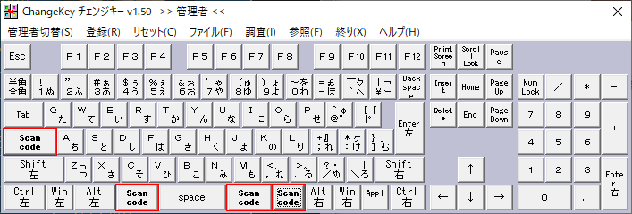

# my-AutoHotKey
My favorite AutoHotKey setting file.

# Premise
[半角/全角、CapsLock、かな(カナロック) などのLock系のキーへのキー割り当てが上手く行かない。](http://ahkwiki.net/Faqs#.E5.8D.8A.E8.A7.92.2F.E5.85.A8.E8.A7.92.E3.80.81CapsLock.E3.80.81.E3.81.8B.E3.81.AA.28.E3.82.AB.E3.83.8A.E3.83.AD.E3.83.83.E3.82.AF.29_.E3.81.AA.E3.81.A9.E3.81.AELock.E7.B3.BB.E3.81.AE.E3.82.AD.E3.83.BC.E3.81.B8.E3.81.AE.E3.82.AD.E3.83.BC.E5.89.B2.E3.82.8A.E5.BD.93.E3.81.A6.E3.81.8C.E4.B8.8A.E6.89.8B.E3.81.8F.E8.A1.8C.E3.81.8B.E3.81.AA.E3.81.84.E3.80.82)に対応するため、「ChangeKey」というフリーソフトを使ってCapsLockキーをF13キーに割り当てるなどをしている。

## キー変更
ChangeKeyで変更したキーは以下の通り。

|変更前キー|変更後キー|
|:---|:---|
|CapsLock|F13|
|無変換|F14|
|変換|F15|
|カタカナ/ひらがな|F16|

## スキャンコード

ChangeKeyでキーの割当を変更する際は、スキャンコードの入力が必要となる。F13~F24までのスキャンコードは以下の通り。

|キー|スキャンコード（Sc）|
|:---|:---|
|F13|0x0064|
|F14|0x0065|
|F15|0x0066|
|F16|0x0067|
|F17|0x0068|
|F18|0x0069|
|F19|0x006A|
|F20|0x006B|
|F21|0x006C|
|F22|0x006D|
|F23|0x006E|
|F24|0x0076|

参考サイト：http://did2.blog64.fc2.com/blog-entry-349.html

# Setting Files
## QuattroTKL.ahk
QuattroTKL 用の設定ファイル。

### コンセプト
* Shortcut allow keys.
    * (F13|F16)+(W|A|S|D) -> Arrow keys.
* Shortcut delete keys.
    * (F13|F16)+(j) -> Backspace key.
    * (F13|F16)+(k) -> Delete key.

# About AutoHotKey
## ダウンロードとインストール
https://www.autohotkey.com/

## 起動方法
`ahk`ファイルをダブルクリック。

## PC起動時にAutoHotKeyの設定を有効にする (Windows)
1. `Win+R`キーを押し、「ファイル名を指定して実行」を起動する。
1. `shell:startup`と入力し、`Enter`キーを押す。
1. 開いたフォルダに、`ahk`ファイルのショートカットファイルを置く。(おそらく `C:\Users\[username]\AppData\Roaming\Microsoft\Windows\Start Menu\Programs\Startup\`).

## 参考サイト
* [AutoHotKyeJP](https://sites.google.com/site/autohotkeyjp/reference)
